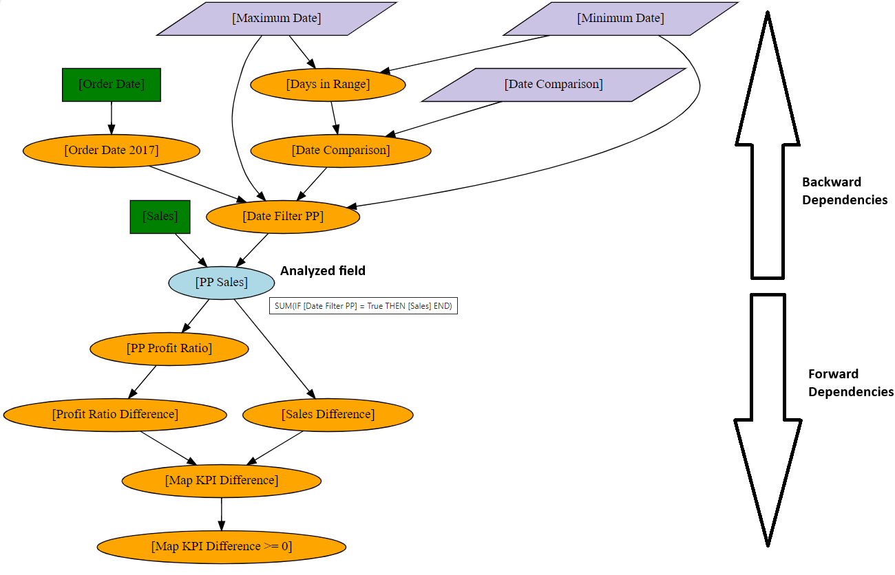

# Tableau Workbook Extractor

The **Tableau Workbook Extractor** is a tool that automatically extracts fields 
and their dependencies from local Tableau workbooks. It utilizes the 
[Tableau Document API](https://tableau.github.io/document-api-python) for 
field extraction and [Graphviz](https://graphviz.org/docs/nodes) with 
[Pydot](https://github.com/pydot/pydot) for visualizing field dependencies.

## Usage

You can use the tool in the following ways:

1. **Downloadable Executable**: You can download the latest executable from 
the [GitHub Releases page](https://github.com/roemeren/tableau-workbook-extractor/releases/latest). 
Note that Graphviz must be installed on your local machine to run the executable.

2. **Web Interface**: Access the deployed Flask application hosted on [Render](https://tableau-workbook-extractor.onrender.com/).

## Screenshots

### Sample Dependency Graph

*Figure 1: Sample dependency graph generated by the tool.*

### Sample Output Excel Table

*Figure 2: Sample output Excel table containing field metadata.*

## Documentation

For detailed usage instructions and additional information, please refer to 
the [full documentation](https://roemeren.github.io/tableau-workbook-extractor/).

## Contributing

If you would like to contribute to the project, please fork the repository and submit a pull request. 

## License

This project is licensed under the MIT License - see the [LICENSE](LICENSE) file for details.