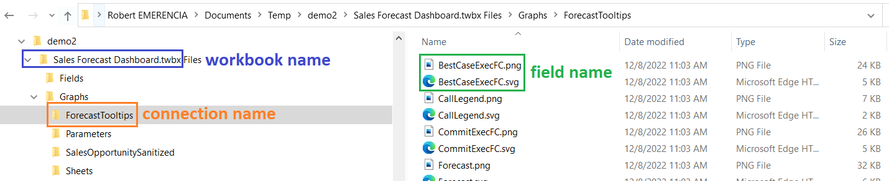

# Tableau Workbook Extractor

Python script & Windows executable to automatically analyze fields and calculations in Tableau workbooks.

## Description

The script prompts the user to browse to a local Tableau workbook (in `.twb` or ` twbx` format), after which 2 types of output are created:

1. An Excel file containing a table of field information and a table of field dependencies. The tables are a cleaned and processed version of information extracted from the [Tableau Document API](https://tableau.github.io/document-api-python/)
2. PNG/SVG images for each field that has at least 1 forward or backward dependency to another field or sheet, consisting of a directed graph of all the field's dependencies. Different colors and shapes indicate dependency types (parameter, data source field, calculated field or sheet). The images are organized in different subfolders. The graphs are generated using [Pydot](https://pypi.org/project/pydot/), a Python interface to [Graphviz](https://graphviz.org/).

## Possible use cases

The tool could be used for the following reasons:

- Get a full overview of **how a field is calculated** (starting from data source fields) and how (much) it is used in sheets and/or other calculations
- Get an overview of **unused fields and calculations**. These could be removed from the workbook or data source if needed to improve performance or to keep extract sizes as low as possible
- Get an overview of the **overall complexity** of the dashboard and check whether or not it is needed to simplify fields by pruning dependencies and fields
- Automate part of the **documentation** process of a dashboard

## What it can't do

Information that **cannot** be extracted from this tool (yet):

- **Role of a field** in sheets: there is no indication if a field in a particular sheet is used as a dimension, measure, filter, tooltip, etc.
- **Direct or indirect dependency** in sheets: there is no indication if a field in a particular sheet is used *directly* in the sheet or *indirectly* through a calculated field that depends on the field
- **Parameter dependencies**: during loading/opening of the workbook some parameters may be initialized by a calculated field in the workbook (e.g. most recent date). These (backward) dependencies are not captured.
- **Full data source dependencies**: fields from a data source are analyzed from the point of view of a particular dashboard. The used data source itself may contain calculated fields that depend on hidden fields that are not available in the workbook. These 'hidden dependencies' from the data source therefore will not be captured. This may be overcome by running the tool separately for the technical workbook that defines the data source.
- **Dashboard dependencies**: the currently used version of the API doesn't contain links between dashboards and sheets (only a `dashboards` workbook property that returns a list of dashboard names). Because of this it is not possible to (for example) know which data sources and/or fields are used in a specific dashboard.
- **Dashboard actions** processing: dashboard actions depend on fields as well as sheets, and have various other properties (source and target fields/sheets, action type, etc.) that are currently not exposed in the Document API.
- **Filter** processing: filters are related to fields but have various other properties (filter expression, filter scope, etc.)

These items may or may not be included in future versions of the [Tableau Document API](https://tableau.github.io/document-api-python/). 


## How to run the script on Windows (Executable)

In short:

1. Install [Graphviz](https://graphviz.org/download/) and make sure that it is added to the Path environment variable
2. Create the Windows executable (see section below: "How to create the Windows Executable and release)"
3. Run the tool (exe file) and browse to the Tableau workbook (twb/twbx) to be analyzed. Tableau doesn't need to be installed to run the tool. After the tool has finished check the output files (Excel + PNG + SVG) created in a newly created folder `<workbook name> Files` inside the workbook's folder

In case the different `.exe` are blocked by the system it can be bypassed by checking the Unblocked property in the executable's file properties.

Each of these steps is explained in detail in the following subsections.

### Step 1: Install Graphviz

Graphviz is open source graph visualization software that is used by the tool 
to export field dependency graphs as images. It should be installed and recognized by the system before running the tool. It can be downloaded here: https://graphviz.org/download/ (section 'Windows').

**Some versions may be blocked** by Microsoft Defender Smartscreen:


This can be bypassed by **right-clicking** on the file and clicking on **Properties**. Next, the **Unblock** option should be checked after which the executable can be run.


An alternative method is to run the exe using the **Command Prompt**: change the directory to the file's download location and then Run the executable with the command `my-executable` or  `my-executable.exe`.

During installation one of the options to **add Graphviz to the PATH variable** should be chosen (by default this is not done):


This way the installation will be recognized while running the tool.

### Step 2: Download the tool

See section below: "How to create the Windows Executable and release".

### Step 3: Run the tool

By **double-clicking** on the downloaded file `tableau-workbook-extractor-<version>.exe` the tool will run and a black window will open to show its progress. 

**It's not necessary to have Tableau Desktop or Public installed**, but it may be useful to verify some of the results.

If the executable is **blocked** again by Microsoft Defender Smartscreen it can be bypassed in the same way as for the Graphviz installer file (see previous subsection).

After initial loading it will prompt the user to **browse to a Tableau workbook** (`.twb` or `.twbx` format):


Next, the **workbook is opened and processed** which includes using the Tableau Document API to extract fields and some cleaning (duplicate removal, cleaning up field names and calculations, etc.). Depending on the number of extracted fields and dependencies this may take a while.

A folder `<workbook name> Files` is created to store all output files:

- The subfolder `/Graphs` contains the output dependency graphs in PNG and SVG format with name `field name>.PNG/SVG`. The files are organized in different subfolders:
    - one subfolder per (data source) connection
    - one subfolder for parameters
    - one subfolder for sheets
    
- The subfolder `/Fields` contains an Excel file with field information and dependencies in 2 sheets `fields` and `dependencies`.
    

If everything runs as expected the user is prompted to **press Enter to exit** the program.


In case something goes the error is printed out after which the user is also prompted to press Enter to exit.


## How to run the script on Windows/Linux/MacOS (Python)

The tool can also be executed by running the `tableau-workbook-extractor.py` from the repository. 

1. Install Graphviz
    - Windows: see previous section
    - Other: see https://graphviz.org/download/
1. **Clone the GitLab repo** by opening a terminal and executing the following commands:
    ```
    cd C:\path\to\root\
    git clone https://git.bdbelux.be/remerencia/tableau-workbook-extractor.git
    ```
2. **Replicate the environment** by creating a new Python 3.8 environment and installing the package versions listed in `requirements.txt`. For example in Anaconda (if Anaconda is not installed use `venv`):

    a. Open a new terminal in Anaconda for example in the `base` environment
    
    b. Create a new conda environment (for example `myenv`) using the following commands:

    ```
    conda create --name myenv python=3.8
    conda activate myenv
    cd C:\path\to\root\myrepo
    pip install -r requirements.txt
    ```
3. **Run the Python script** by running the command `python tableau-workbook-extractor.py` inside the working directory (= downloaded repo folder)

**Note**: the script **hasn't been tested on Linux and MacOS** and still have a known **open issue** related to backward vs forward file path separators.

## Other ways to run the script (not available yet)

In the future other ways to run the tool may be implemented:

- **Separate Linux and/or MacOS executables**: these can be created by running [PyInstaller](https://pyinstaller.org/en/stable/) separately on these operations systems. 
- **Docker containers**: this is a platform-independent solution that only requires the installation of [Docker](https://www.docker.com/). Running the container will automatically create the environment (Graphviz + Python + package versions) and run the tool. It however has some disadvantages: 
    - Docker should be installed and run from the command line (= less user-friendly)
    - GUI elements (file browsers) may not work correctly anymore on 1 or more operating systems. This means that the GUI elements should be replaced by specifying arguments (like the full path to the workbook) in text format in the command line (= less user-friendly)

## How to create the Windows Executable and release

The tool's executable is created using the [PyInstaller](https://pyinstaller.org/en/stable/) package. It bundles a Python application and all its dependencies into a single package, in this case an exe file.

For any commit in the repo an executable version `tableau-workbook-extractor.exe` of the main script `tableau-workbook-extractor.py` can be created as follows:

1. Clone the repo locally and replicate the environment (see section 'How to run the script on Windows/Linux/MacOS (Python)'). This will make sure that the PyInstaller package gets installed as well.
2. Activate the environment and change the directory to the repo directory (that contains the `tableau-workbook-extractor.py` script)
3. Run the command `pyinstaller --onefile tableau-workbook-extractor.py`. This will create a new executable `tableau-workbook-extractor.exe` in a subfolder `dist`. This file as well as other files that are created (e.g. in the `build` subfolder) are not tracked and therefore will not impact the repository.
4. This file can be renamed and used in the next releases of the tool

## Known issues

- **Not all dependencies are captured**: 
    - fields may not be used in sheets but to *initialize parameter values* when the workbook is opened/loaded
    - data source fields may depend on fields that *hidden in the data source* and are not visible in the dashboard
    - fields and parameters may be used in *dashboard actions*
- **Not all field captions are captured**: field captions may be missing and therefore their internal ID will be used in the outputs (may be related to hidden fields and dependencies)
- **Not all extracted fields are assigned to the correct data source**: some (copies of) fields may be linked to a data source it doesn't belong to
- **Path separators in non-Windows OS**: currently the tool processes file path using backslashes (\) as in Windows. Linux and MacOS use forward slashes which will lead to incorrect output file paths.

## Roadmap

Some possible extensions/fixes:

- **Batch processing** of a set or folder of workbooks at once
- **Remove multi-line comments** from cleaned calculated fields (anything between /* and */)
- **General code refactoring**: the current pandas implementation may not be the fastest/shortest
- **Evaluate included field information**: currently not all available field attributes from the API are included (only the ones that were initially considered the most relevant). It may be useful to include more or unprocessed versions of attributes in the next releases.
- **Improve the quality/readability of the output graphs** e.g. colors, fonts, node arrangement of the PNG/SVG images
- **Implement fixes for additional edge cases**: there may still be workbooks that cause errors in the tool e.g. because of unusual field names with invalid characters
- **Expand to multiple OS**: modify the script and executable to be able to run the tool (correctly) on Linux and/or MacOS. The first fix would be to modify the input/output file paths such that they are processed correctly on all OS (forward and backward slashes)

## Sources

- [Document API Python documentation](https://tableau.github.io/document-api-python/): describes how workbook and field information can be extracted
- [Pydot repository](https://github.com/pydot/pydot): methods and attributes in `pydot` package used for visualizing graphs
- [Graphviz documentation](https://graphviz.org/docs/nodes/): node and graph attributes
- [PyInstaller documentation](https://graphviz.org/docs/nodes/): bundling a Python application and all its dependencies into a single packages (i.e. Windows executable)

## Contributing

Feel free to contribute or improve this tool! See the 'Roadmap' section for possible ideas and the 'Sources' section for background documentation on some of the external libraries that are used.

## Project status

Currently information can be extracted from a single workbook using the Windows executable and should be correct for a large number of Tableau workbooks. There are however still some exceptional cases that may be improved further, possibly after future API update checks. It may also be required in the future to run the tool on non-Windows operating systems.