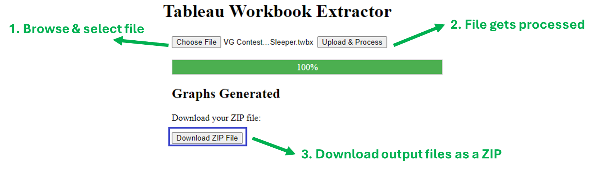

# Tableau Workbook Extractor

## Quickstart

To get started with the Tableau Workbook Extractor, you can:

- **Download the latest Windows executable**: 
[Download Executable](https://github.com/roemeren/tableau-workbook-extractor/releases/latest) 
*([Graphviz](https://graphviz.org/download/) must be installed and included in your PATH variable.)*
- **Run the application on Render**: [Access the Deployed Application](https://tableau-workbook-extractor.onrender.com/) *(May take a while to load)*
- **View the documentation**: [Documentation](https://roemeren.github.io/tableau-workbook-extractor/main)

## Description

The **Tableau Workbook Extractor** is your new best friend when it comes to 
untangling the web of field dependencies in Tableau workbooks. 
Ever spent way too long manually clicking through field after field, 
trying to trace the logic behind a particular calculation? 
We've been there—painstakingly playing detective with right-clicks and 
recursive field checks. But fear not!

This tool automates that entire process for you, **extracting fields and their dependencies** 
from local Tableau workbooks in seconds. It leverages 
the power of the [Tableau Document API](https://tableau.github.io/document-api-python)
for precise field extraction and visualizes those tangled dependencies 
beautifully using [Graphviz](https://graphviz.org/docs/nodes) and 
[Pydot](https://github.com/pydot/pydot). No more right-click marathons—just clean, 
structured tables of metadata and stunning dependency graphs, so you can get 
straight to the insights.

## Usage

You can use the tool in two main ways.

### Option 1: Download and Run the Windows Executable

Download the latest executable from the [GitHub Releases page](https://github.com/roemeren/tableau-workbook-extractor/releases/latest). 
Note that Graphviz must be installed on your local machine to run the executable.

Workflow steps:

1. **Select Input File**: Choose the Tableau workbook file you want to analyze using the file selection dialog.
2. **Process the File**: The tool will automatically analyze the workbook after selecting the file.
3. **Obtain Output**: The output files will be saved automatically on your local machine.

*Workflow of the Tableau Workbook Extractor Windows executable.*

### Option 2: Access the Web App

Access the deployed Flask application hosted on [Render](https://tableau-workbook-extractor.onrender.com/). Note that it may take a while to load.

Workflow steps:

1. **Select Input File**: Click the "Choose File" button to browse and choose 
the Tableau workbook file you want to analyze.
2. **Process the File**: Click the  "Upload & Process" button to analyze the 
workbook. The tool will extract field dependencies and generate the output.
3. **Obtain Output**: Download and unpack the generated ZIP file containing the output files.

*Workflow of the Tableau Workbook Extractor web app.*

### More Ways to Use the Tool

For advanced users or developers, additional ways to run the tool locally or 
customize the workflow are available. You can find detailed instructions in the 
[documentation](https://roemeren.github.io/tableau-workbook-extractor/main/usage.html).

## Screenshots

### Sample Dependency Graph

*Sample dependency graph generated by the tool.*

### Sample Output Excel Table: Field Metadata

*Sample output Excel table containing field metadata.*

### Sample Output Excel Table: Tabular Representation of Dependency Graph

*Sample output Excel table containing tabular representation of nodes and edges.*

## Documentation

For detailed usage instructions and additional information, please refer to 
the [full documentation](https://roemeren.github.io/tableau-workbook-extractor/main).

## Inspiration
This project was inspired by the [Medium article](https://christian-knoell.medium.com/unravel-the-complexity-of-tableau-workbooks-using-python-and-graphviz-c7e60111461a) 
by Christian Knoell, which explores using Python and Graphviz to analyze Tableau workbooks. The 
[accompanying gist](https://gist.github.com/054ad072718a9fe9c4314f833523980a.git) 
provides the code related to the concepts discussed in the article.

## Contributing

If you would like to contribute to the project, please fork the repository and submit a pull request. 

## License

This project is licensed under the MIT License - see the [LICENSE](LICENSE) file for details.
