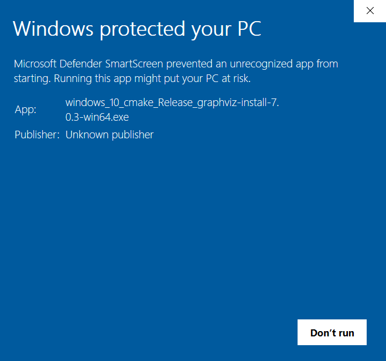

# Tableau Workbook Extractor

Python script + Windows executable to automatically analyze fields and calculations in Tableau workbooks.

## Description

The script prompts the user to select a locally saved Tableau workbook (in `.twb` or `.twbx` format), after which 2 outputs are created:

1. An Excel file containing a table of field information and a table of field dependencies. The tables are a cleaned and processed version of information extracted from the [Tableau Document API](https://tableau.github.io/document-api-python/)
2. PNG/SVG image files `<source_name>/<field_name>.png/svg` for each field that has at least 1 dependency to ('forward' dependency) or from ('backward' dependency) another field or sheet, containing a directed graph of all the field's dependencies with different colors and shapes indicating the dependency types (parameter, data source field or calculated field). The graphs are generated using [Pydot](https://pypi.org/project/pydot/), a Python interfact to [Graphviz](https://graphviz.org/). The output graphs are organized in subfolders per data source as well as a separate subfolder for sheets.

## Possible use cases

The outputs from this tool could be useful for the following reasons:

- Get a full overview of **how a field is calculated** (starting from the data source) and how (much) it is used in sheets and/or other calculations
- Get an overview of **unused fields and calculations** that could be removed from the Tableau if needed to improve performance or to keep extract sizes as low as possible
- Get an overview of **overall complexity** of the dashboard and check whether or not it is needed to simplify fields by pruning dependencies
- Automate the **documentation** process of the dashboard

## What it can't do (yet)

Information that **cannot** be extracted from this tool:

- **Role of a field** in visualizations (dimension/measure/filter/tooltip/etc.)
- **Parameter dependencies** e.g. initialization of parameter that depends on a (calculated) field when loading the workbook
- **Hidden data source fields** processing; the focus is on fields that are effectively used in a dashboard and doesn't necessarily correspond to the full list of available (possibly hidden) data source fields
- **Dashboard actions** processing: dashboard actions may include fields as well as other sheets. These dependencies are currently not captured by the Document API and/or this tool.
- **Filter** processing: similar to dashboard actions filters include fields as well as a set of sheets they are applied to.
- **Direct sheet dependencies**: the current sheet dependencies of a field can be direct (= directly applied as tooltip/text/dimension/etc.) or indirect (= calculated field *based on this field* is applied as tooltip/text/dimension etc. but not the field itself). Currently there is no way to known if a sheet dependency is direct or indirect.

## How to run the script on Windows (Executable)

### Step 1: Install Graphviz

Graphviz is open source graph visualization software that is used by the tool 
to export field dependency graphs as images. It should be downloaded before 
running the tool. It can be downloaded here: https://graphviz.org/download/ (section 'Windows').

**Some versions may be blocked** by Microsoft Defender Smartscreen:



This can be bypassed by **right-clicking** on the file and clicking on **Properties**. Next, the **Unblock** option should be checked after which the executable can be run.


Another method is to run the exe using the **Command Prompt**: change the directory to the file's download location and then Run the executable with the command `myfile` or  `myfile.exe`.

During installation one of the options to **add Graphviz to the PATH variable** should be chosen (by default this is not done):


This way the installation will be recognized while running the tool.

### Step 2: Download the tool

The latest release of the tool can be downloaded as an exe file from https://git.bdbelux.be/remerencia/tableau-workbook-extractor/-/releases (name: `tableau-workbook-extractor-<version>.exe`):


The URL points to a shared file on OneDrive that can be downloaded. After downloading it can be moved to a convenient location (it can be run from anywhere).

### Step 3: Run the tool

By **double-clicking** on the downloaded file `tableau-workbook-extractor-<version>.exe` the tool will run and a black window will open to show its progress. 

**Note**: if the executable is **blocked** again by Microsoft Defender Smartscreen it can be run by unblocking it in the file's properties or by running it in the Command Prompt (see also previous section wrt Graphviz executable).

After initial loading it will prompt the user to **browse to a Tableau workbook** (`.twb` or `.twbx` format):


Next, the **workbook is opened and processed** which includes using the Tableau Document API to extract fields and some cleaning (duplicate removal, removal of certain characters, cleaning up calculated field expressions, etc.). Depending on the number of extracted fields and dependencies this may take a while.

A folder `<workbook name> Files` is created to store all output files:

- The subfolder `/Graphs` contains the output dependency graphs in PNG and SVG format with name `field name>.PNG/SVG`. The files are organized in different subfolders:
    - one subfolder per (data source) connection
    - one subfolder for parameters
    - one subfolder for sheets
    
- The subfolder `/Fields` contains an Excel file with field information and dependencies in 2 sheets `fields` and `dependencies`.
    

If everything runs as expected the user is prompted to **press Enter to exit** the program.


In case something goes the error is printed out after which the user is also prompted to press Enter to exit.


## How to run the script on Windows/Linux/MacOS (Python)

The tool can also be executed by running the `tableau-workbook-extractor.py` from the repository. 

1. Install Graphviz
    - Windows: see previous section
    - Other: see https://graphviz.org/download/
1. **Clone the GitLab repo** by opening a terminal and executing the following commands:
    ```
    cd C:\path\to\root\
    git clone https://git.bdbelux.be/remerencia/tableau-workbook-extractor.git
    ```
2. **Replicate the environment** by creating a new Python 3.8 environment and installing the package versions listed in `requirements.txt`. For example in Anaconda (if Anaconda is not installed use `venv`):

    a. Open a new terminal in Anaconda for example in the `base` environment
    
    b. Create a new conda environment (for example `myenv`) using the following commands:

    ```
    conda create --name myenv python=3.8
    conda activate myenv
    cd C:\path\to\root\myrepo
    pip install -r requirements.txt
    ```
3. **Run the Python script** by running the command `python tableau-workbook-extractor.py` inside the working directory (= downloaded repo folder)

**Important note**: the script **hasn't been tested on Linux and MacOS** and still have a known **open issue** related to backward vs forward path separators when reading/writing files.

## Other ways to run the script (not available yet)

In the future other ways to run the tool may be implemented:

- **Separate Linux and/or MacOS executables**: these can be created by running [PyInstaller](https://pyinstaller.org/en/stable/) separately on these operations systems. 
- **Docker containers**: this is a platform-independent solution that only requires the user to have [Docker](https://www.docker.com/) installed. Running the container will automatically create the environment (Graphviz + Python + proper package versions) and run the tool. Disadvantages: Docker should be installed + GUI elements (like the file browser in the first step) may not work anymore and should be replaced by command-line argumants (in this case the full path to the Tableau workbook)

## How to create the Windows Executable and release

If the repo is updated a new executable can be created using the [PyInstaller](https://pyinstaller.org/en/stable/) package:

- Check out the commit/tag (= version) locally for which the executable should be created
- Open a terminal and make sure that the proper environment is active (Python version + all package requirements installed, see before)
- Change the working directory to the one containg the `tableau-workbook-extractor.py` script
- Run the command `pyinstaller --onefile tableau-workbook-extractor.py`. This will create a new executable `tableau-workbook-extractor.exe` in a subfolder `dist` as well as some other files/folders (`build`, `tableau-workbook-extractor.spec`). All created files are ignored for version tracking.
- Rename the file `tableau-workbook-extractor.exe` to `tableau-workbook-extractor-<version>.exe` which can be added to a new release (associated with the tag/version)


## Known issues

- **Not all dependencies are captured**: 
    - it is possible that flagged fields/parameters are still used/useful in the workbook because they are for example used in a dashboard URL action. Deleting it in Tableau will (surprisingly) not raise any warnings but the field removal may cause issues.
    - if fields are based on hidden fields from a data source these dependencies won't be captured and/or shown in the outputs
- **Not all field captions are captured**: some data source field captions (among other attributes) are missing when using the Tableau Document API while these captions can be located in the workbook's raw XML (within the `<metadata-record>`'s `<caption>` tag). It appears to be related to hidden fields (maybe previously unhidden?) in the data source.
- **Not all fields are assigned to the correct data source**: for unknown reasons some (copies of) fields are assigned to a data source it doesn't belong to. This may also be related to open issues in the Document API.
- **Path separators in non-Windows OS**: the tool doesn't process output file paths correctly yet since it assumes Windows-style paths with backslashes (\) rather than forward slashes (/) used in other OS. In case the tool is used in these OS a fix should be implemented.


## Roadmap

Some possible extensions/fixes:

- **Batch processing** of a set or folder of workbooks at once
- **Remove multi-line comments** from cleaned calculated fields (anything between /* and */)
- **General code refactoring**: the current pandas implementation may not be the fastest/shortest
- **Check for new versions of the Document API**: Currently not all extracted information is 100% correct or directly usable which is why additional processing is needed to fix some known issues. The API may improve in the future, removing the need of some of these processing operations.
- **Evaluate the included field information & structure and modify if needed**: Not all possible field information from the API is included at the moment. Additional information may be extracted (specially if a new version is used in the future).
- **Improve the quality/readability of the output graphs** (e.g. colors, fonts, node arrangement)
- **Implement fixes for additional edge cases**: There may still be notebooks that cause errors in the tool e.g. because of invalid characters that are used in field names.
- **Expand to multiple OS**: modify the script and executable to be able to run the tool (correctly) on Linux and/or MacOS. The first fix would be to modify the input/output file paths such that they are processed correctly on all OS (forward and backward slashes)

## Sources

- [Document API Python documentation](https://tableau.github.io/document-api-python/): describes how workbook and field information can be extracted
- [Pydot repository](https://github.com/pydot/pydot): methods and attributes in `pydot` package used for visualizing graphs
- [Graphviz documentation](https://graphviz.org/docs/nodes/): node and graph attributes
- [PyInstaller documentation](https://graphviz.org/docs/nodes/): bundling a Python application and all its dependencies into a single packages (i.e. Windows executable)

## Contributing

Feel free to contribute or improve this tool! See the 'Roadmap' section for possible ideas and the 'Sources' section for background documentation on some of the external libraries that are used.
State if you are open to contributions and what your requirements are for accepting them.

## Project status

Currently information can be extracted from a single workbook using the Windows executable and should be correct for a large number of Tableau workbooks. There are however still some exceptional cases that may be improved further, possibly after future API update checks. It may also be required in the future to run the tool on non-Windows operating systems.